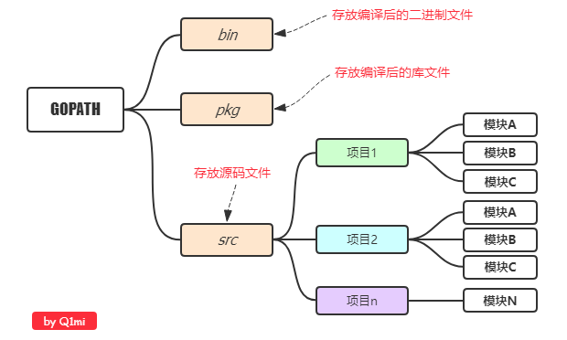
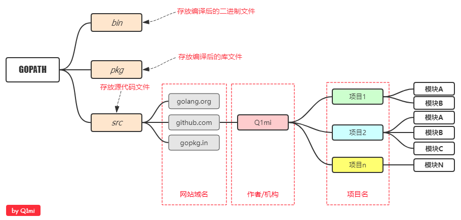
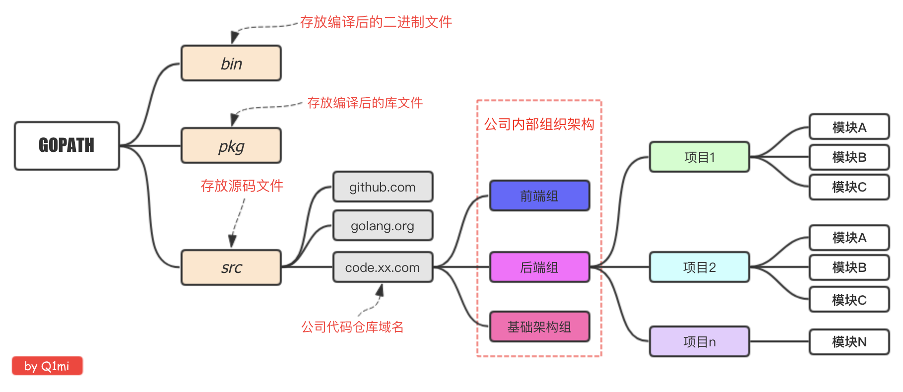

## Go项目结构
在进行Go语言开发的时候，我们的代码总是会保存在$GOPATH/src目录下。在工程经过go build、go install或go get等指令后，会将下载的第三方包源代码文件放在$GOPATH/src目录下， 产生的二进制可执行文件放在 $GOPATH/bin目录下，生成的中间缓存文件会被保存在 $GOPATH/pkg 下。
>适合个人开发

源代码都是存放在GOPATH的src目录下，那我们可以按照下图来组织我们的代码。

>目前流行的项目结构

Go语言中也是通过包来组织代码文件，我们可以引用别人的包也可以发布自己的包，但是为了防止不同包的项目名冲突，我们通常使用顶级域名来作为包名的前缀，这样就不担心项目名冲突的问题了

>适合企业开发场景

