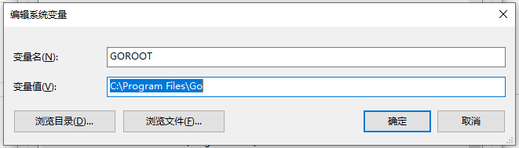
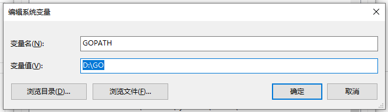
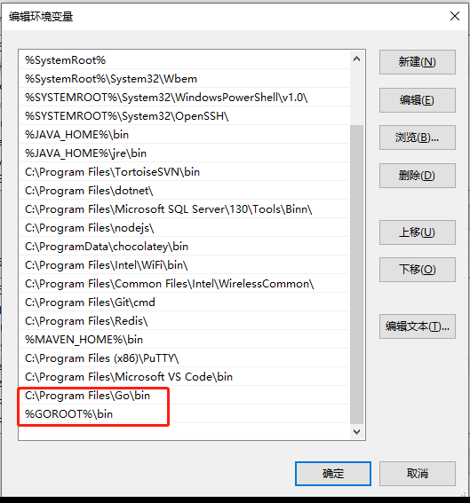

## 步骤一：Go语言SDK下载和安装
去中文社区的下载https://studygolang.com/dl
## 步骤二：Go语言环境变量配置
安装Go语言需要配置的环境变量有GOROOT、GOPATH和Path
1. 配置GOROOT
   GOROOT的变量值即为GO的安装目录
   
   
2. 配置GOPATH
   GOPATH的变量值即为存储Go语言项目的路径
   
   
3. 配置Path
   Path中有其他安装程序的配置信息，这里再增加一个GO的bin目录
   
   
## 步骤三：验证是否配置成功
1. 打开命令行工具，输入命令go env
~~~shell
C:\Users\Administrator>go env
set GO111MODULE=
set GOARCH=amd64
set GOBIN=
set GOCACHE=C:\Users\Administrator\AppData\Local\go-build
set GOENV=C:\Users\Administrator\AppData\Roaming\go\env
set GOEXE=.exe
set GOFLAGS=
set GOHOSTARCH=amd64
set GOHOSTOS=windows
set GOINSECURE=
set GOMODCACHE=D:\GO\pkg\mod
set GONOPROXY=
set GONOSUMDB=
set GOOS=windows
set GOPATH=D:\GO
set GOPRIVATE=
set GOPROXY=https://goproxy.io
set GOROOT=C:\Program Files\Go
set GOSUMDB=sum.golang.org
set GOTMPDIR=
set GOTOOLDIR=C:\Program Files\Go\pkg\tool\windows_amd64
set GOVCS=
set GOVERSION=go1.16
set GCCGO=gccgo
set AR=ar
set CC=gcc
set CXX=g++
set CGO_ENABLED=1
set GOMOD=NUL
set CGO_CFLAGS=-g -O2
set CGO_CPPFLAGS=
set CGO_CXXFLAGS=-g -O2
set CGO_FFLAGS=-g -O2
set CGO_LDFLAGS=-g -O2
set PKG_CONFIG=pkg-config
set GOGCCFLAGS=-m64 -mthreads -fno-caret-diagnostics -Qunused-arguments -fmessage-length=0 -fdebug-prefix-map=C:\Users\ADMINI~1\AppData\Local\Temp\go-build3744306628=/tmp/go-build -gno-record-gcc-switches
~~~
2. 查看go的版本
~~~shell
C:\Users\Administrator>go version
go version go1.16 windows/amd64
~~~
